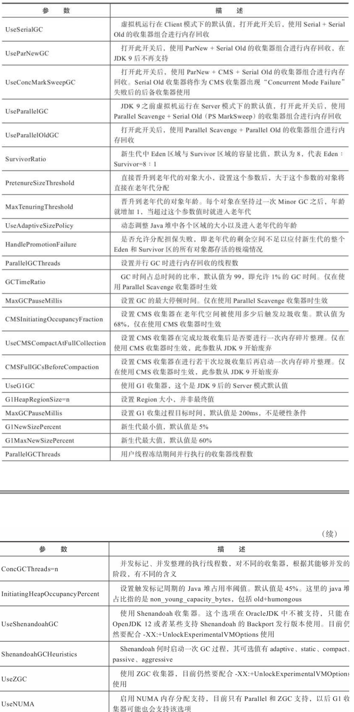

# 垃圾收集 (GC)

垃圾收集（Garbage Collection，GC），它的任务是解决以下 3 件问题：

- 哪些内存需要回收？
- 什么时候回收？
- 如何回收？

其中第一个问题很好回答，在 Java 中，GC 主要发生在 Java 堆和方法区中，对于后两个问题，我们将在之后的内容中进行讨论，并介绍 HotSpot 的 7 个垃圾收集器。

<!-- TOC -->

- [垃圾收集 (GC)](#垃圾收集-gc)
    - [判断对象的生死](#判断对象的生死)
        - [判断对象是否可用的算法](#判断对象是否可用的算法)
            - [引用计数算法](#引用计数算法)
            - [可达性分析算法（主流）](#可达性分析算法主流)
        - [四种引用类型](#四种引用类型)
        - [宣告对象死亡的两次标记过程](#宣告对象死亡的两次标记过程)
        - [方法区的回收](#方法区的回收)
    - [垃圾收集算法](#垃圾收集算法)
        - [基础：标记 - 清除算法](#基础标记---清除算法)
        - [解决效率问题：复制算法](#解决效率问题复制算法)
        - [解决空间碎片问题：标记 - 整理算法](#解决空间碎片问题标记---整理算法)
        - [进化：分代收集算法](#进化分代收集算法)
    - [HotSpot 中 GC 算法的实现](#hotspot-中-gc-算法的实现)
    - [7 个垃圾收集器](#7-个垃圾收集器)
        - [Serial / ParNew 搭配 Serial Old 收集器](#serial--parnew-搭配-serial-old-收集器)
        - [Parallel 搭配 Parallel Scavenge 收集器](#parallel-搭配-parallel-scavenge-收集器)
        - [CMS 收集器](#cms-收集器)
        - [G1 收集器](#g1-收集器)
    - [GC 日志解读](#gc-日志解读)

<!-- /TOC -->

## 判断对象的生死

什么时候回收对象？当然是这个对象再也不会被用到的时候回收。所以要想解决 “什么时候回收？” 这个问题，我们要先能判断一个对象什么时候什么时候真正的 “死” 掉了，判断对象是否可用主要有以下两种方法。

### 判断对象是否可用的算法

#### 引用计数算法

- **算法描述：**
	- 给对象添加一个引用计数器；
	- 每有一个地方引用它，计数器加 1；
	- 引用失效时，计数器减 1；
	- 计数器值为 0 的对象不再可用。
- **缺点：**
	- 很难解决循环引用的问题。即 `objA.instance = objB; objB.instance = objA;`，objA 和 objB 都不会再被访问后，它们仍然相互引用着对方，所以它们的引用计数器不为 0，将永远不能被判为不可用。

#### 可达性分析算法（主流）

- **算法描述：**
	- 从 "GC Root" 对象作为起点开始向下搜索，走过的路径称为引用链（Reference Chain）；
	- 从 "GC Root" 开始，不可达的对象被判为不可用。
- **Java 中可作为 “GC Root” 的对象：**
	- 栈中（本地变量表中的reference）
		- 虚拟机栈中，栈帧中的本地变量表引用的对象；
		- 本地方法栈中，JNI 引用的对象（native方法）；
	- 方法区中
		- 类的静态属性引用的对象；
		- 常量引用的对象；
(注: 除以上两种情况外单纯堆中实例数据所引用的对象不能作为GC Root, 但如果其在引用链中, 可认为可达)
即便如此，一个对象也不是一旦被判为不可达，就立即死去的，宣告一个的死亡需要经过两次标记过程。

### 四种引用类型

JDK 1.2 后，Java 中才有了后 3 种引用的实现。

- **强引用：** 像 `Object obj = new Object()` 这种，只要强引用还存在，垃圾收集器就永远不会回收掉被引用的对象。
- **软引用：** 用来引用还存在但非必须的对象。对于软引用对象，在 OOM 前，虚拟机会把这些对象列入回收范围中进行第二次回收，如果这次回收后，内存还是不够用，就 OOM。实现类：`SoftReference`。
- **弱引用：** 被弱引用引用的对象只能生存到下一次垃圾收集前，一旦发生垃圾收集，被弱引用所引用的对象就会被清掉。实现类：`WeakReference`。
- **虚引用：** 幽灵引用，对对象没有半毛钱影响，甚至不能用来取得一个对象的实例。它唯一的用途就是：当被一个虚引用引用的对象被回收时，系统会收到这个对象被回收了的通知。实现类：`PhantomReference`。

### 宣告对象死亡的两次标记过程

- 当发现对象不可达后，该对象被第一次标记，并进行是否有必要执行 `finalize()` 方法的判断；
	- 不需要执行：对象没有覆盖 `finalize()` 方法，或者 `finalize()` 方法已被执行过（`finalize()` 只被执行一次）；
	- 需要执行：将该对象放置在一个队列中，稍后由一个虚拟机自动创建的低优先级线程执行。
- `finalize()` 方法是对象逃脱死亡的最后一次机会，不过虚拟机不保证等待 `finalize()` 方法执行结束，也就是说，虚拟机只触发 `finalize()` 方法的执行，如果这个方法要执行超久，那么虚拟机并不等待它执行结束，所以最好不要用这个方法。
- `finalize()` 方法能做的，try-finally 都能做，所以忘了这个方法吧！

### 方法区的回收

永久代的 GC 主要回收：**废弃常量** 和 **无用的类**。

- 废弃常量：例如一个字符串 "abc"，当没有任何引用指向 "abc" 时，它就是废弃常量了。
- 无用的类：同时满足以下 3 个条件的类。
	- 该类的所有实例已被回收，Java 堆中不存在该类的任何实例；
	- 加载该类的 Classloader 已被回收；
	- 该类的 Class 对象没有被任何地方引用，即无法在任何地方通过反射访问该类的方法。

## 垃圾收集算法

### 基础：标记 - 清除算法

- **算法描述：**
	- 先标记出所有需要回收的对象（图中深色区域）；
	- 标记完后，统一回收所有被标记对象（留下狗啃似的可用内存区域……）。
- **不足：**
	- 效率问题：标记和清理两个过程的效率都不高。
	- 空间碎片问题：标记清除后会产生大量不连续的内存碎片，导致以后为较大的对象分配内存时找不到足够的连续内存，会提前触发另一次 GC。

### 解决效率问题：复制算法

- **算法描述：**

  - 将可用内存分为大小相等的两块，每次只使用其中一块；
  - 当一块内存用完时，将这块内存上还存活的对象复制到另一块内存上去，将这一块内存全部清理掉。
- **不足：** 可用内存缩小为原来的一半，适合GC过后只有少量对象存活的新生代。
- **节省内存的方法：**
	- 新生代中的对象 98% 都是朝生夕死的，所以不需要按照 1:1 的比例对内存进行划分；
	- 把内存划分为：
		- 1 块比较大的 Eden 区；
		- 2 块较小的 Survivor 区；
	- 每次使用 Eden 区和 1 块 Survivor 区；
	- 回收时，将以上 2 部分区域中的存活对象复制到另一块 Survivor 区中，然后将以上两部分区域清空；
	- JVM 参数设置：`-XX:SurvivorRatio=8` 表示 `Eden 区大小 / 1 块 Survivor 区大小 = 8`。

### 解决空间碎片问题：标记 - 整理算法

- **算法描述：**
	- 标记方法与 “标记 - 清除算法” 一样；
	- 标记完后，将所有存活对象向一端移动，然后直接清理掉边界以外的内存。
- **不足：** 存在效率问题，适合老年代。

### 进化：分代收集算法

- **新生代：** GC 过后只有少量对象存活 —— **复制算法**
- **老年代：** GC 过后对象存活率高 —— **标记 - 整理算法**

## HotSpot 中 GC 算法的实现

通过前两小节对于判断对象生死和垃圾收集算法的介绍，我们已经对虚拟机是进行 GC 的流程有了一个大致的了解。但是，在 HotSpot 虚拟机中，高效的实现这些算法也是一个需要考虑的问题。所以，接下来，我们将研究一下 HotSpot 虚拟机到底是如何高效的实现这些算法的，以及在实现中有哪些需要注意的问题。

通过之前的分析，GC 算法的实现流程简单的来说分为以下两步：

1. 找到死掉的对象；
2. 把它清了。

想要找到死掉的对象，我们就要进行可达性分析，也就是从 GC Root 找到引用链的这个操作。

也就是说，进行可达性分析的第一步，就是要枚举 GC Roots，这就需要虚拟机知道哪些地方存放着对象应用。如果每一次枚举 GC Roots 都需要把整个栈上位置都遍历一遍，那可就费时间了，毕竟并不是所有位置都存放在引用呀。所以为了提高 GC 的效率，HotSpot 使用了一种 OopMap 的数据结构，**OopMap 记录了栈上本地变量到堆上对象的引用关系**，也就是说，GC 的时候就不用遍历整个栈只遍历每个栈的 OopMap 就行了。

在 OopMap 的帮助下，HotSpot 可以快速准确的完成 GC 枚举了，不过，OopMap 也不是万年不变的，它也是需要被更新的，当内存中的对象间的引用关系发生变化时，就需要改变 OopMap 中的相应内容。可是能导致引用关系发生变化的指令非常之多，如果我们执行完一条指令就改下 OopMap，这 GC 成本实在太高了。

因此，HotSpot 采用了一种在 “安全点” 更新 OopMap 的方法，安全点的选取既不能让 GC 等待的时间过长，也不能过于频繁增加运行负担，也就是说，我们既要让程序运行一段时间，又不能让这个时间太长。我们知道，JVM 中每条指令执行的是很快的，所以一个超级长的指令流也可能很快就执行完了，所以 **真正会出现 “长时间执行” 的一般是指令的复用，例如：方法调用、循环跳转、异常跳转等**，虚拟机一般会将这些地方设置为安全点更新 OopMap 并判断是否需要进行 GC 操作。

此外，在进行枚举根节点的这个操作时，为了保证准确性，我们需要在一段时间内 “冻结” 整个应用，即 Stop The World（传说中的 GC 停顿），因为如果在我们分析可达性的过程中，对象的引用关系还在变来变去，那是不可能得到正确的分析结果的。即便是在号称几乎不会发生停顿的 CMS 垃圾收集器中，枚举根节点时也是必须要停顿的。这里就涉及到了一个问题：

**我们让所有线程跑到最近的安全点再停顿下来进行 GC 操作呢？**

主要有以下两种方式：

- 抢先式中断：
	- 先中断所有线程；
	- 发现有线程没中断在安全点，恢复它，让它跑到安全点。
- **主动式中断：** (主要使用)
	- 设置一个中断标记；
	- 每个线程到达安全点时，检查这个中断标记，选择是否中断自己。

除此安全点之外，还有一个叫做 “安全区域” 的东西，一个一直在执行的线程可以自己 “走” 到安全点去，可是一个处于 Sleep 或者 Blocked 状态的线程是没办法自己到达安全点中断自己的，我们总不能让 GC 操作一直等着这些个 ”不执行“ 的线程重新被分配资源吧。对于这种情况，我们要依靠安全区域来解决。

**安全区域是指在一段代码片段之中，引用关系不会发生变化，因此在这个区域中的任意位置开始 GC 都是安全的。**

当线程执行到安全区域时，它会把自己标识为 Safe Region，这样 JVM 发起 GC 时是不会理会这个线程的。当这个线程要离开安全区域时，它会检查系统是否在 GC 中，如果不在，它就继续执行，如果在，它就等 GC 结束再继续执行。

本小节我们主要讲述 HotSpot 虚拟机是如何发起内存回收的，也就是如何找到死掉的对象，至于如何清掉这些个对象，HotSpot 将其交给了一堆叫做 ”GC 收集器“ 的东西，这东西又有好多种，不同的 GC 收集器的处理方式不同，适用的场景也不同，我们将在下一小节进行详细讲述。

## 7 个垃圾收集器

垃圾收集器就是内存回收操作的具体实现，HotSpot 里足足有 7 种，为啥要弄这么多，因为它们各有各的适用场景。有的属于新生代收集器，有的属于老年代收集器，所以一般是搭配使用的（除了万能的 G1）。关于它们的简单介绍以及分类请见下图。

### Serial / ParNew 搭配 Serial Old 收集器

Serial 收集器是虚拟机在 Client 模式下的默认新生代收集器，它的优势是简单高效，在单 CPU 模式下很牛。

ParNew 收集器就是 Serial 收集器的多线程版本，虽然除此之外没什么创新之处，但它却是许多运行在 Server 模式下的虚拟机中的首选新生代收集器，因为除了 Serial 收集器外，只有它能和 CMS 收集器搭配使用。

### Parallel 搭配 Parallel Scavenge 收集器

首先，这俩货肯定是要搭配使用的，不仅仅如此，它俩还贼特别，它们的关注点与其他收集器不同，其他收集器关注于尽可能缩短垃圾收集时用户线程的停顿时间，而 Parallel Scavenge 收集器的目的是达到一个可控的吞吐量。

> 吞吐量 = 运行用户代码时间 / ( 运行用户代码时间 + 垃圾收集时间 )

因此，Parallel Scavenge 收集器不管是新生代还是老年代都是多个线程同时进行垃圾收集，十分适合于应用在注重吞吐量以及 CPU 资源敏感的场合。

可调节的虚拟机参数：

- `-XX:MaxGCPauseMillis`：最大 GC 停顿的秒数；
- `-XX:GCTimeRatio`：吞吐量大小，一个 0 ~ 100 的数，`最大 GC 时间占总时间的比率 = 1 / (GCTimeRatio + 1)`；
- `-XX:+UseAdaptiveSizePolicy`：一个开关参数，打开后就无需手工指定 `-Xmn`，`-XX:SurvivorRatio` 等参数了，虚拟机会根据当前系统的运行情况收集性能监控信息，自行调整。

### CMS 收集器

**参数设置：**

- `-XX:+UseCMSCompactAtFullCollection`：在 CMS 要进行 Full GC 时进行内存碎片整理（默认开启）
- `-XX:CMSFullGCsBeforeCompaction`：在多少次 Full GC 后进行一次空间整理（默认是 0，即每一次 Full GC 后都进行一次空间整理）

> **关于 CMS 使用 标记 - 清除 算法的一点思考：**
>
> 之前对于 CMS 为什么要采用 标记 - 清除 算法十分的不理解，既然已经有了看起来更高级的 标记 - 整理 算法，那 CMS 为什么不用呢？最近想了想，感觉可能是这个原因，不过也不是很确定，只是个人的一种猜测。
>
> 标记 - 整理 会将所有存活对象向一端移动，然后直接清理掉边界以外的内存。这就意味着需要一个指针来维护这个分隔存活对象和无用空间的点，而我们知道 CMS 是并发清理的，虽然我们启动了多个线程进行垃圾回收，不过如果使用 标记 - 整理 算法，为了保证线程安全，在整理时要对那个分隔指针加锁，保证同一时刻只有一个线程能修改它，**加锁的这一过程相当于将并行的清理过程变成了串行的，也就失去了并行清理的意义了。**
>
> 所以，CMS 采用了 标记 - 清除 算法。

### G1 收集器

## GC 日志解读

## 垃圾收集器参数总结

